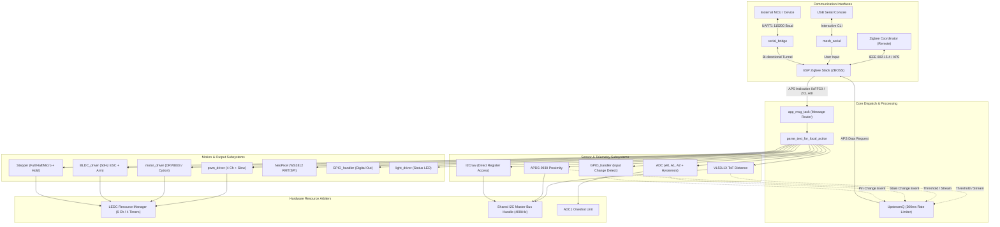
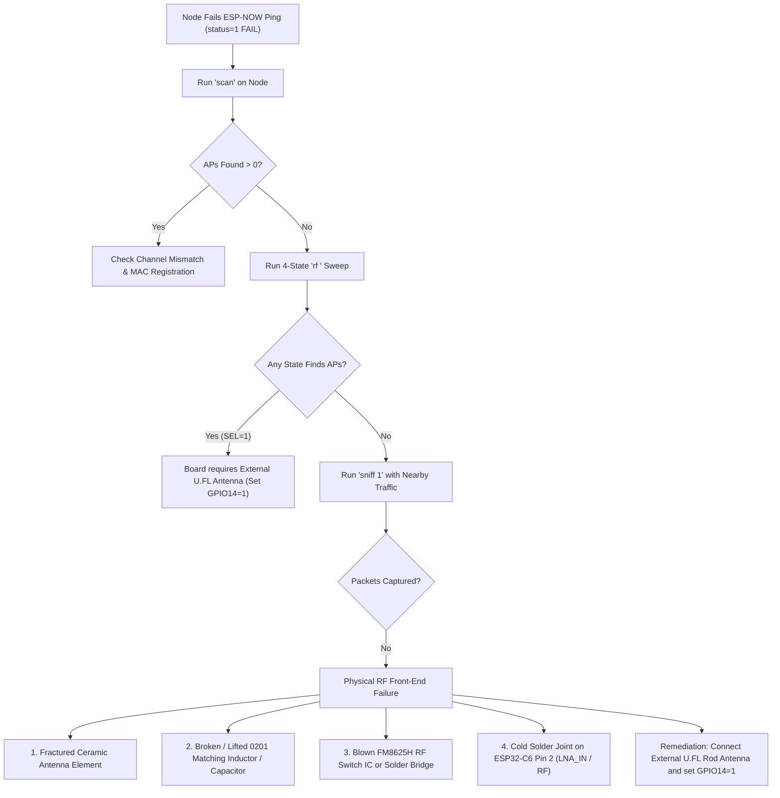
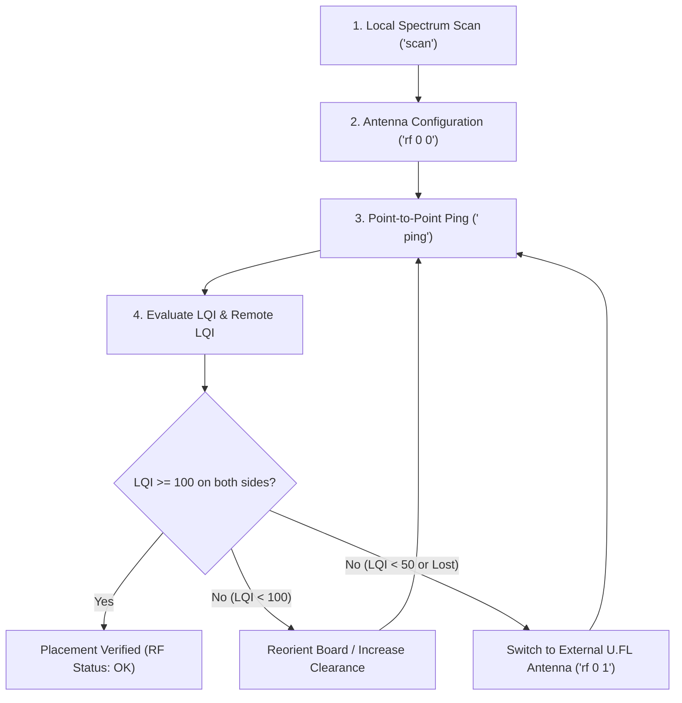

# PNPzigbee Firmware: Architecture, Features & Functional Specification
**Target Platform:** Espressif ESP32-C6 (32-bit RISC-V @ 160MHz)  
**Framework:** ESP-IDF v6.0 | FreeRTOS | ESP-Zigbee-SDK (ZBOSS 1.6.x)  
**Role:** Zigbee 3.0 End Device / Router with Distributed Multi-Peripheral Control

---

## 1. Executive Summary

The **PNPzigbee** firmware turns an ESP32-C6 system-on-chip into a versatile, mesh-networked actuator and sensor controller. Communicating via standard **Zigbee 3.0** (IEEE 802.15.4) and a local USB/UART console, it bridges remote mesh coordinator commands to a wide array of physical hardware interfaces:
- **Motion & Motors:** DC motors (DRV8833 & Cytron 10C), Brushless DC (ESC-driven), 4-phase Steppers (Full/Half/Microstep with current-limiting PWM), and 4 independent hardware PWM channels.
- **Sensors:** Time-of-Flight distance (VL53L1X), optical proximity/ambient light (APDS-9930), 12-bit ADC channels with software hysteresis comparators, and dynamic GPIO monitoring.
- **Visuals & Bridging:** Multi-pixel WS2812 addressable RGB LEDs (NeoPixels), onboard indicator LED, and a full-duplex hardware UART serial bridge.
- **Resilience:** Centralized hardware timer management (LEDC arbiter), upstream message rate-limiting (`UpstreamQ`), and dual command routing (direct command or targeted addressing).

---

## 2. System Architecture

### 2.1 High-Level Architecture Diagram



---

## 3. Communication & Mesh Protocol

### 3.1 Zigbee 3.0 Implementation
- **Profile:** Home Automation (`ESP_ZB_AF_HA_PROFILE_ID`, 0x0104)
- **Device Type:** On/Off Light Bulb (`HA_ESP_LIGHT_ENDPOINT = 10`)
- **Network Role:** Zigbee End Device (`ESP_ZB_DEVICE_TYPE_ED`) or Router (`ESP_ZB_DEVICE_TYPE_ROUTER`), selectable via build flags.
- **Custom Application Cluster (`0xFFC0`):**
  Used for bidirectional ASCII payload streaming and formatted binary packet transmission (`AppMessage` struct with `cmd[18]` and `int16_t value`).
- **Standard ZCL Attribute Handling:**
  Listens for `ESP_ZB_ZCL_CLUSTER_ID_ON_OFF` `ON_OFF` attribute updates to maintain ecosystem compatibility with standard Zigbee coordinators (Home Assistant, Zigbee2MQTT, etc.).

### 3.2 Command Grammar & Routing
Incoming text packets are parsed by `parse_text_for_local_action()` using a dual-mode grammar:

1. **Direct Mode (Unicast / Broadcast to self):**
   ```text
   <Command> [Value1] [Value2]
   Example: MotorSpeed 500
   Example: pwm1 800
   Example: NeoRED 0 255
   ```
2. **Targeted Mode (Sub-device / Multi-node addressing):**
   ```text
   <TargetNode> <Command> [Value1] [Value2]
   Example: NODE_B MotorSpeed 500
   ```
   If `<TargetNode>` does not match a known local command, the router checks if the second token is a recognized command.

### 3.3 Upstream Throttling (`UpstreamQ`)
To prevent saturation of Zigbee transmission buffers and APS acknowledgment queues, all asynchronous event messages (sensor threshold triggers, digital state changes, telemetry streams) pass through `SendTheMessage()`.
- **Queue Depth:** 10 messages of up to 32 bytes each.
- **Throttling Task:** Dedicated FreeRTOS task enforcing a minimum `200ms` transmission window between outgoing mesh packets.

---

## 4. Hardware Resource Management

### 4.1 LEDC Peripheral Arbiter (`ledc_manager`)
The ESP32-C6 features **6 LEDC PWM channels** and **4 hardware timers** in low-speed mode. Multiple drivers (`pwm_driver`, `motor_driver`, `BLDC_driver`, `Stepper`) require PWM generation. The `ledc_manager` prevents peripheral collisions:
- **Timer Sharing:** When a driver requests a timer (e.g., `ledc_manager_alloc_timer(freq_hz, &timer)`), the arbiter first checks if an active timer is already running at that exact frequency. If so, it shares that timer index, saving scarce timer resources.
- **Channel Allocation:** Channels 0 through 5 are allocated dynamically on a first-come, first-served basis with tracking of in-use states.

### 4.2 Shared I2C Bus Architecture
Sensors (`VL53L1X`, `APDS-9930`) and the raw I2C tool (`I2Craw`) utilize the new ESP-IDF v6.0 unified `i2c_master` driver:
- **Bus Speed:** 400 kHz Fast-Mode.
- **Bus Ownership:** Initialized once via `get_shared_i2c_bus()`. Multiple device handles are attached to the same bus handle, preventing bus re-initialization crashes.

---

## 5. Subsystem Detailed Specifications

### 5.1 Motor & Actuator Drivers

#### 1. DC Motor Driver (`motor_driver`)
Supports bidirectional brushed DC motor control with speed ramp slew rate limiting:
- **Operating Modes:**
  - `Mode 0 (DRV8833)`: Dual-PWM H-Bridge control using 2 LEDC channels.
  - `Mode 1 (Cytron 10C)`: Single PWM speed channel + standard GPIO directional pin.
- **Speed Range:** `-1000` (full reverse) to `+1000` (full forward), `0` = dynamic brake/stop.
- **Slew Rate Generator:** FreeRTOS task updates motor output every 20ms according to configurable slew units per second.

#### 2. Brushless DC Motor Driver (`BLDC_driver`)
Controls standard 3-phase BLDC motors via an electronic speed controller (ESC):
- **PWM Waveform:** Standard RC servo signal (50Hz / 20ms period).
- **Pulse Range:** 1000 µs (full reverse) $\rightarrow$ 1500 µs (neutral/stop) $\rightarrow$ 2000 µs (full forward).
- **Safety Arming Sequence:** `BLDCarm` executes a blocking 2-second neutral signal sequence before allowing non-zero throttle.

#### 3. 4-Phase Stepper Controller (`Stepper`)
Direct four-pin phase control for unipolar or bipolar stepper motors:
- **Modes:** Full-Step, Half-Step, and Micro-Step lookup tables.
- **Holding Current:** `HoldPWM` sets a reduced PWM duty cycle when the motor is stationary to prevent overheating while maintaining holding torque.
- **Motion Profiling:** Configurable acceleration and deceleration step profiles with programmable step delay (`msPerStep`).

#### 4. Multi-Channel PWM Driver (`pwm_driver`)
Provides 4 general-purpose PWM channels (1–4):
- **Resolution:** 10-bit hardware resolution (0 to 1023 duty cycle).
- **Dynamic Configuration:** Per-channel frequency, GPIO assignment, and linear slew rate limiting.

#### 5. Addressable RGB Strip (`NeoPixel`)
- **Driver:** ESP-IDF `led_strip` component (RMT / SPI backend).
- **RAM Buffer:** Internal RGB frame buffer supporting indexed color updates (`NeoRED`, `NeoGREEN`, `NeoBLUE`) before atomically committing to hardware with `NeoUpdate`.

---

### 5.2 Sensor & Telemetry Subsystems

#### 1. Time-of-Flight Distance (`VL53L1X`)
- **Range:** Millimeter-accurate optical distance measurement up to 4 meters.
- **Hysteresis Alerting:** Monitors `VLUpperThresh` and `VLLowerThresh`. Triggers an upstream Zigbee notification when an object enters or leaves the defined window.
- **Streaming:** Optional real-time distance streaming (`StreamVL 1`).

#### 2. Proximity & Light (`APDS-9930`)
- **Sensing:** Optical infrared proximity with configurable pulse count (`Npulses`).
- **Hysteresis Comparator:** Evaluates upper and lower proximity thresholds; reports state transitions to the coordinator.

#### 3. 12-Bit Analog Input (`adc`)
- **Channels:** `A0` (GPIO 2), `A1` (GPIO 3), `A2` (GPIO 10).
- **Comparator Engine:** Software Schmitt-trigger comparator. When the raw analog voltage surpasses `UpperThresh`, comparator sets high; when it drops below `LowerThresh`, comparator clears. State transitions automatically enqueue an upstream event.

#### 4. Dynamic Digital I/O (`GPIO_handler`)
- **Features:** Dynamic pin assignment as inputs or outputs.
- **Background Polling:** A 50ms polling task tracks all configured input pins. Any state change instantly generates an upstream Zigbee report: `GPIO <pin> CHANGED TO <0|1>`.

---

### 5.3 Communication Bridges & Consoles

#### 1. Hardware UART Bridge (`serial_bridge`)
- **Peripheral:** `UART_NUM_1` (TX: GPIO 17, RX: GPIO 16 @ 115200 baud).
- **Operation:** Completely transparent bidirectional link between the Zigbee mesh and a connected microcontroller (e.g., Arduino, host PC, or sensor board).

#### 2. USB Serial Console (`mesh_serial`)
- **Peripheral:** ESP32-C6 USB-Serial/JTAG controller.
- **Interactive Shell:** Local terminal interface with line editing, backspace handling, command echoing, and direct message forwarding to the mesh coordinator.

---

## 6. FreeRTOS Task Hierarchy

| Task Name | Core / Pri | Stack Size | Purpose |
| :--- | :--- | :--- | :--- |
| `esp_zb_task` | Core 0 / P5 | 4096 B | ZBOSS Zigbee 3.0 protocol stack & commissioning event loop |
| `app_msg_task` | Core 0 / P5 | 3072 B | Central message dispatcher; parses commands from mesh/serial |
| `serial_console_task`| Core 0 / P5 | 3072 B | Interactive USB console reader and line editor |
| `button_task` | Core 0 / P5 | 2048 B | 20ms debounced monitor for physical button (GPIO 9) |
| `throttle_task` | Core 0 / P5 | 2048 B | Upstream message queue consumer (200ms rate limiter) |
| `gpio_poll_task` | Core 0 / P5 | 2048 B | 50ms periodic digital pin state change scanner |
| `motor_slew_task` | Core 0 / P5 | 2048 B | 20ms motor speed ramp generator |
| `pwm_slew_task` | Core 0 / P5 | 2048 B | 20ms multi-channel PWM duty cycle ramp generator |
| `vl53_task` | Core 0 / P5 | 3072 B | 50ms ToF distance reading, filtering, and threshold check |
| `prox_task` | Core 0 / P5 | 3072 B | 20ms optical proximity reading and threshold evaluation |
| `adc_task` | Core 0 / P5 | 2048 B | Periodic round-robin analog sampling and hysteresis evaluation |
| `serial_bridge_rx_task` | Core 0 / P5 | 2048 B | Hardware UART1 character receiver and line buffer |

---

## 7. Complete Command Reference Dictionary

All commands can be sent as raw Zigbee APS text payloads, ZCL strings, or typed in the USB serial console.

### 7.1 System & Indicators
| Command | Parameters | Description | Response / Event |
| :--- | :--- | :--- | :--- |
| `PING` | *none* | Test mesh connectivity and measure link quality | `PONG LQI=<val>` |
| `blink` | `<count> [ms]` | Blink onboard status LED `count` times with `ms` period | `OK` |
| `on` | *none* | Turn standard light state ON | `GOT ON OK` |
| `off` | *none* | Turn standard light state OFF | `GOT OFF OK` |
| `SetupSerialBridge` | *none* | Initialize hardware UART1 serial bridge on GPIO 16/17 | `SETUP SERIAL OK` |

### 7.2 PWM Subsystem
| Command | Parameters | Description | Response / Event |
| :--- | :--- | :--- | :--- |
| `SetupPWM<1-4>` | *none* | Allocate hardware timer/channel for PWM channel 1–4 | `SETUP PWM<n> OK` |
| `pwmPin<1-4>` | `<gpio>` | Assign output GPIO pin to PWM channel | `GOT PWMPIN<n> OK` |
| `pwmFreq<1-4>` | `<freq_hz>` | Set frequency in Hz for PWM channel | `GOT PWMFREQ<n> OK` |
| `pwmSlew<1-4>` | `<units/sec>` | Set linear duty ramp rate (`0` = instantaneous) | `GOT PWMSLEW<n> OK` |
| `pwm<1-4>` | `<duty>` | Set target 10-bit duty cycle (`0` to `1023`) | `GOT PWM<n> OK` |

### 7.3 DC & BLDC Motors
| Command | Parameters | Description | Response / Event |
| :--- | :--- | :--- | :--- |
| `SetupMotorDriver` | `<mode> <freq>` | Init DC motor (`0`=DRV8833, `1`=Cytron 10C) at `freq` Hz | `GOT MOTORSPEED OK` |
| `MotorSpeed` | `<speed>` | Set motor speed and direction (`-1000` to `+1000`) | `GOT MOTORSPEED OK` |
| `MotorSlew` | `<rate>` | Set speed ramp rate (speed units / second) | `GOT MOTORSLEW OK` |
| `SetupBLDC` | *none* | Initialize 50Hz ESC PWM channel | `SETUP BLDC OK` |
| `BLDCarm` | *none* | Execute 2-second ESC neutral arming sequence | `BLDC ESC Armed` |
| `BLDCspeed` | `<speed>` | Set ESC throttle (`-1000` to `+1000`, `0`=neutral) | `GOT BLDCSPEED OK` |

### 7.4 Stepper Motor
| Command | Parameters | Description | Response / Event |
| :--- | :--- | :--- | :--- |
| `SetupStepper` | *none* | Initialize stepper driver subsystem | `SETUP STEPPER OK` |
| `ApGPIO`, `AnGPIO` | `<gpio>` | Set Phase A positive / negative GPIO pins | `GOT APGPIO OK` |
| `BpGPIO`, `BnGPIO` | `<gpio>` | Set Phase B positive / negative GPIO pins | `GOT BPGPIO OK` |
| `FullStep` | *none* | Select Full-Step drive mode | `GOT FULLSTEP OK` |
| `HalfStep` | *none* | Select Half-Step drive mode | `GOT HALFSTEP OK` |
| `MicroStep` | *none* | Select Micro-Step drive mode | `GOT MICROSTEP OK` |
| `msPerStep` | `<ms>` | Set delay between steps in milliseconds | `GOT MSPERSTEP OK` |
| `Step` | `<steps>` | Move stepper specified number of steps (signed) | `GOT STEP OK` |
| `PWMFreq` | `<freq_hz>` | Set current-limiting PWM chopper frequency | `GOT PWMFREQ OK` |
| `PWMDuty` | `<duty_pct>` | Set drive duty cycle percentage | `GOT PWMDUTY OK` |
| `HoldPWM` | `<duty_pct>` | Set stationary holding torque duty cycle | `GOT HOLDPWM OK` |
| `Accel`, `Decel` | `<steps>` | Set ramp acceleration / deceleration step counts | `GOT ACCEL/DECEL OK` |

### 7.5 NeoPixel (Addressable RGB)
| Command | Parameters | Description | Response / Event |
| :--- | :--- | :--- | :--- |
| `NeoGPIO` | `<gpio>` | Assign output pin and initialize LED strip | `GOT NEOGPIO OK` |
| `NeoRED` | `<index> <val>` | Set red component (0–255) for pixel index in buffer | `GOT NEORED OK` |
| `NeoGREEN`| `<index> <val>` | Set green component (0–255) for pixel index in buffer | `GOT NEOGREEN OK` |
| `NeoBLUE` | `<index> <val>` | Set blue component (0–255) for pixel index in buffer | `GOT NEOBLUE OK` |
| `NeoUpdate`| *none* | Flush buffer to physical WS2812 strip | `GOT NEOUPDATE OK` |

### 7.6 Analog & Digital I/O
| Command | Parameters | Description | Response / Event |
| :--- | :--- | :--- | :--- |
| `SetupADC<A0-A2>`| *none* | Initialize 12-bit ADC channel (A0=GPIO2, A1=GPIO3, A2=GPIO10) | `SETUP ADC<ch> OK` |
| `ReadADC<A0-A2>` | *none* | Read instantaneous raw 12-bit ADC value | `ADCval<ch> <val>` |
| `ADCupperThresh<A0-A2>` | `<val>` | Set upper trigger threshold for hysteresis | `GOT ADCUPPERTHRESH<ch> OK` |
| `ADCLowerThresh<A0-A2>` | `<val>` | Set lower trigger threshold for hysteresis | `GOT ADCLOWERTHRESH<ch> OK` |
| `SetupGPIOhandler` | *none* | Start background GPIO state change detector | `SETUP GPIO OK` |
| `ModeGPIOin` | `<gpio>` | Configure pin as digital input with pull-up | `GOT MODEIN OK` |
| `ModeGPIOout` | `<gpio>` | Configure pin as digital output | `GOT MODEOUT OK` |
| `SetGPIOval` | `<gpio> <val>` | Set digital output level (0 or 1) | `GOT SETGPIO OK` |
| `ReadGPIO` | `<gpio>` | Query digital input level | `GPIO <pin> IS <0\|1>` |

### 7.7 Distance, Proximity & Raw I2C
| Command | Parameters | Description | Response / Event |
| :--- | :--- | :--- | :--- |
| `SetupVL` | *none* | Init VL53L1X ToF sensor & start distance task | `SETUP VL OK` / `FAIL` |
| `StreamVL` | `<0\|1>` | Enable/disable live distance streaming | `VL STREAM ON/OFF` |
| `VLUpperThresh` | `<mm>` | Set distance upper alert threshold | `GOT VLUPPERTHRESH OK` |
| `VLLowerThresh` | `<mm>` | Set distance lower alert threshold | `GOT VLLOWERTHRESH OK` |
| `SetupProximity` | *none* | Init APDS-9930 proximity sensor & start task | `SETUP PROX OK` / `FAIL` |
| `StreamProx` | `<0\|1>` | Enable/disable live proximity streaming | `PROX STREAM ON/OFF` |
| `Npulses` | `<count>` | Set optical IR emitter pulse count | `GOT NPULSES OK` |
| `UpperThresh`, `LowerThresh` | `<val>` | Set proximity alert thresholds | `GOT UPPER/LOWERTHRESH OK` |
| `rawI2CchipADR` | `<7bit_addr>` | Select target I2C slave address | `I2C CHIP ADR OK` |
| `rawI2Cwr` | `<reg> <val>` | Write 1 byte to register over I2C | `I2C WR OK` |
| `rawI2Crd` | `<reg>` | Read 1 byte from register over I2C | `I2Cval <reg> <val>` |

---

## 8. Memory & Partition Layout

The firmware utilizes a custom partition table optimized for Zigbee network credential persistence, OTA application staging, and secure storage:

```csv
# Name,       Type, SubType, Offset,   Size,    Flags
nvs,          data, nvs,     0x9000,   0x6000,
phy_init,     data, phy,     0xf000,   0x1000,
factory,      app,  factory, 0x10000,  900K,
zb_storage,   data, fat,     0xf1000,  16K,
zb_fct,       data, fat,     0xf5000,  1K,
```
- **Application Binary Footprint:** ~600 KB (`0x92910` bytes).
- **Available App Partition Headroom:** 35% free space remaining in the 900 KB factory partition.
- **Non-Volatile Storage (NVS):** Stores Zigbee binding tables, encryption keys, and network PAN credentials across power cycles.

---

## 9. Hardware-in-the-Loop Test Fixture: TXRXproto

### 9.1 Overview & System Role

The **`TXRXproto`** project (located in `C:\Users\egape\TXRXproto`) serves as the dedicated **Hardware-in-the-Loop (HIL) verification fixture and downstream client** for the Zigbee mesh network. 

Physically wired to the ESP32-C6 node's hardware UART serial bridge, `TXRXproto` provides immediate visual and serial feedback confirming that packets sent from the remote coordinator successfully traverse the wireless Zigbee mesh, get dispatched across the node's serial bridge, and arrive uncorrupted at the end-actuator.

```text
┌─────────────────────────────────┐
│     PuTTY / Host PC Terminal     │
└───────────────┬─────────────────┘
                │ Serial Console ("Kitchen blinkx 5")
                ▼
┌─────────────────────────────────┐
│    Coordinator (ESP32-C6)       │
└───────────────┬─────────────────┘
                │ Zigbee 3.0 Mesh (IEEE 802.15.4 / APS 0xFFC0)
                ▼
┌─────────────────────────────────┐
│       PNPzigbee (ESP32-C6)      │
│     serial_bridge (UART1)       │
└───────────────┬─────────────────┘
                │ Hardware Serial (115200 Baud / 8-N-1)
                ▼
┌─────────────────────────────────┐
│     TXRXproto (SAMD21 / M0)     │
│   • Built-in LED Heartbeat      │
│   • DotStar Blue 'blinkx' LED   │
│   • Bi-directional USB Bridge   │
└─────────────────────────────────┘
```

---

### 9.2 Hardware & Platform Specifications

| Parameter | Specification | Notes |
| :--- | :--- | :--- |
| **Microcontroller** | Microchip / Atmel ATSAMD21E18A | 32-bit ARM Cortex-M0+ @ 48 MHz |
| **Board Profile** | Adafruit Trinket M0 / ItsyBitsy M0 Express | `[env:adafruit_trinket_m0]` |
| **Framework** | Arduino via PlatformIO (`atmelsam`) | Embedded C++ |
| **Primary Libraries** | `Adafruit DotStar`, `SPI` | Fast hardware SPI / bit-bang pixel driver |
| **Operating Voltage** | 3.3V Logic | Direct logic-level compatibility with ESP32-C6 |
| **Interface Ports** | Dual Serial (USB CDC + Hardware UART1) | Concurrent monitoring and bridge routing |

---

### 9.3 Serial Architecture & Transparent Bridging

`TXRXproto` manages two independent serial interfaces concurrently within a non-blocking `loop()` cycle:

1. **Host USB Console (`Serial` @ 9600 Baud):**
   - Connects to the host PC via native USB CDC.
   - Provides an interactive terminal for developers using PuTTY or the PlatformIO Serial Monitor.
   - Any character entered by the user is directly forwarded to the ESP32-C6 via `Serial1.write()`.

2. **Inter-Board Hardware Link (`Serial1` @ 115200 Baud):**
   - Wired directly to the ESP32-C6 UART pins managed by [`serial_bridge.c`](file:///c:/Users/egape/PNPzigbee/main/serial_bridge.c).
   - Inbound characters from the ESP32-C6 are immediately mirrored back to the host USB console (`Serial.write()`) to preserve transparent bridge visibility.
   - Concurrently, incoming characters are buffered into a 96-byte line accumulator (`processEsp32Byte`) to detect and execute local fixture commands.

---

### 9.4 Verification Protocol Commands

When the Zigbee coordinator sends a text command targeted at the node, the ESP32-C6 serial bridge emits the raw string across UART. `TXRXproto` parses incoming lines and services two dedicated verification commands:

#### 1. Two-Way Serial Round-Trip (`ping` → `GotPing`)
* **Inbound Command:** `<TargetName> ping` (or `ping`, case-insensitive).
* **Execution & Response:**
  * Arduino transmits `GotPing\r\n` back out hardware `Serial1`.
  * The ESP32-C6 `serial_bridge` picks up `GotPing` and transmits it via Zigbee APS message back to the Coordinator.
  * The Coordinator prints `< <TargetName>: GotPing` to the PC host / test runner.
* **Verification Significance:** Confirms 100% two-way communication end-to-end:
  `Host (PC) → Coordinator → Zigbee Over-The-Air → ESP32-C6 Node → UART1 → Arduino → UART1 → ESP32-C6 Node → Zigbee Over-The-Air → Coordinator → Host (PC)`.

#### 2. Visual Actuation (`blinkx <Count>`)
* **Inbound Command:** `<TargetName> blinkx <Count>` (e.g., `Kitchen blinkx 7` or `Garage blinkx 3`).
* **Parser Logic:** Discards the routing prefix `<TargetName>`, bounds-checks `<Count>` (0–50, defaults to 1), and triggers the non-blocking DotStar RGB LED state machine `startBlinkx(count)`.
* **Execution:** Emits confirmation upstream: `[Arduino] blinkx <value>`.

#### 3. Hardware DAC Voltage Generation (`setDAC <Value>`)
* **Inbound Command:** `<TargetName> setDAC <Value>` (e.g., `Kitchen setDAC 512` or `setDAC 1023`).
* **Hardware Output:** Generates true analog DC voltage on Trinket M0 pin **`A0`** via the internal SAMD21 10-bit DAC (`analogWriteResolution(10)`).
  * Range: `0` (0.0V) to `1023` (3.3V). Formula: $V_{out} = \frac{\text{Value}}{1023} \times 3.3\,\text{V}$.
* **Execution & Response:**
  * Arduino sets voltage on pin `A0`.
  * Transmits `GotDAC <Value>\r\n` back across `Serial1` to the ESP32-C6.
  * The Coordinator outputs `< <TargetName>: GotDAC <Value>`.
* **HIL ADC Testing Application:** By wiring Trinket M0 pin **`A0`** to an ESP32-C6 ADC input (e.g., `GPIO2 / A0`), the host test suite can command arbitrary reference voltages, read back the ADC measurement via Zigbee (`ReadADCA0`), and automatically verify the ADC calibration of the ESP32-C6 over the air.

#### 4. Digital Output Pin Control (`setx` / `clrx`)
* **Inbound Command:** `<TargetName> setx` (set D0 HIGH) / `<TargetName> clrx` (clear D0 LOW).
* **Hardware Output:** Drives digital pin **`D0`** on the SAMD21 (ItsyBitsy M0 / Trinket M0) to logic HIGH (3.3V) with `setx`, or logic LOW (0.0V) with `clrx`.
* **Execution & Response:**
  * Arduino sets/clears pin `D0`.
  * Transmits `GotSetx\r\n` or `GotClrx\r\n` back across `Serial1` to the ESP32-C6.
  * The Coordinator outputs `< <TargetName>: GotSetx` or `< <TargetName>: GotClrx`.
* **HIL Digital Input Testing Application:** By wiring Arduino pin **`D0`** to an ESP32-C6 GPIO input pin configured for state change detection (`ModeGPIOin`), the host test suite can command arbitrary digital state toggles over the air and verify that the ESP32-C6 detects the edge transition and fires the expected asynchronous upstream Zigbee event (`GPIO <pin> CHANGED TO <0|1>`).

---

### 9.5 Visual Status Indicators

`TXRXproto` employs two independent, non-blocking visual indicators:

#### 1. Liveness Heartbeat (`LED_BUILTIN` - Red LED)
* **Behavior:** A non-blocking asynchronous timing pattern executed every cycle:
  * 1000 ms ON &rarr; 1000 ms OFF &rarr; Three rapid 100 ms strobe pulses.
* **Purpose:** Proves that the SAMD21 scheduler is active, non-starved, and interrupts are functioning normally.

#### 2. Zigbee Verification Indicator (DotStar Addressable RGB LED)
* **Hardware:** Onboard APA102 / DotStar RGB LED driven via `PIN_DOTSTAR_DATA` (D41) and `PIN_DOTSTAR_CLOCK` (D40).
* **Color:** **Vibrant Blue** (`0x0000FF`) at 40/255 brightness.
* **Cadence:** 200 ms ON / 200 ms OFF per pulse.
* **Non-Blocking Operation:** `serviceBlinkx()` runs strictly on `millis()` timestamps, ensuring serial bridge throughput is never delayed or interrupted during long multi-blink sequences.

---

## 10. Comprehensive RF Diagnostics & Findings

This section documents the Hardware-in-the-Loop (HIL) RF troubleshooting methodology and test procedure developed to diagnose wireless communication failures, silent nodes, and layer-2 802.11 ACK timeouts on ESP32-C6 devices (specifically the Seeed Studio XIAO ESP32-C6).

### 10.1 Layer-2 802.11 ACK Protocol Mechanics
In the ESP-NOW communication protocol:
* **Unicast Transmissions:** When a frame is dispatched to a specific unicast MAC address, the receiving device's Wi-Fi hardware PHY/MAC in silicon must automatically generate and transmit an IEEE 802.11 ACK frame within SIFS (Short Interframe Space, ~10–16 $\mu\text{s}$). The firmware application layer does not participate in ACK generation.
* **Failure Symptom:** If the transmitting device does not detect the layer-2 ACK within its hardware retry timeout (~50–60 ms), the transmit callback reports:
  ```text
  I (...) COORDINATOR_ESPNOW: esp_now_send returned ESP_OK (0)
  I (...) COORDINATOR_ESPNOW: ESP-NOW TX cb: status=1 (FAIL)
  ```
* **Failure Scope:** A `status=1 (FAIL)` callback indicates that either:
  1. The destination device never received the frame (RF path open, antenna defective, or channel mismatch).
  2. The destination device received the frame and transmitted an ACK, but the sender failed to detect the ACK.
  3. The receiver's silicon Station MAC does not match the frame's destination address.

---

### 10.2 Diagnostic Tooling & Interactive CLI Commands
The firmware integrates real-time serial console diagnostic commands accessible via the USB-Serial/JTAG interface (115200 baud):

| Command | Parameters | Description | Example Output |
| :--- | :--- | :--- | :--- |
| **`rf <pwr> <sel>`** | `pwr`: 0=ON, 1=OFF<br>`sel`: 0=Ceramic, 1=U.FL | Controls the Seeed Studio XIAO ESP32-C6 **FM8625H RF multiplexer switch** GPIO pins. | `RF pins set: PWR=0, SEL=0` |
| **`sniff <0\|1>`** | `0`: Disable<br>`1`: Enable | Toggles Wi-Fi **promiscuous mode** sniffer. Disables MAC address filtering and prints RSSI / length of every 2.4 GHz packet received. | `[SNIFF] PKT len=128 rssi=-64` |
| **`scan`** | *none* | Performs an active Wi-Fi spectrum scan across all 2.4 GHz channels (1–11) and lists detected SSIDs, RSSI, and channels. | `Found 4 APs`<br>`SSID: Verizon_T3GC73, RSSI: -80, Chan: 6` |
| **`bcast <text>`** | `text` string | Sends an unacknowledged ESP-NOW broadcast frame to `FF:FF:FF:FF:FF:FF`. | `broadcast queued` |

---

### 10.3 Four-Step RF Diagnostic Procedure

When a node exhibits persistent `status=1 (FAIL)` transmission errors or fails to acknowledge coordinator discovery sweeps, execute the following four-step diagnostic procedure:

#### Step 1: Radio & PHY Boot Calibration Verification
Verify that the device boots cleanly and reads valid radio calibration parameters:
1. Confirm station MAC address:
   ```text
   I (...) wifi:mode : sta (b4:3a:45:8a:c7:c0)
   ```
2. Verify primary Wi-Fi channel and maximum transmitter power:
   ```text
   I (...) MESH_ESPNOW: Wi-Fi Config: Actual Channel=1 (second=0), Max TX Power=80 (0.25dBm units)
   ```
   *(Power value 80 corresponds to maximum +20.0 dBm output).*
3. Confirm initial RF switch pin state readback:
   ```text
   I (...) MESH_ESPNOW: RF Switch pins: PWR(GPIO3)=0, SEL(GPIO14)=0
   ```

#### Step 2: 4-State RF Switch Sweep
The Seeed Studio XIAO ESP32-C6 routes RF through an FM8625H switch controlled by:
* **`GPIO 3` (PWR):** Active-LOW enable (driving `0` powers ON the switch; driving `1` isolates the switch).
* **`GPIO 14` (SEL):** Antenna path multiplexer (`0` routes to onboard ceramic antenna; `1` routes to gold U.FL connector).

Iterate through all four binary states while testing bidirectional transmissions:
```text
rf 0 0    # State 1: Power ON, Onboard Ceramic Antenna
rf 0 1    # State 2: Power ON, External U.FL Connector
rf 1 0    # State 3: Power OFF, High-impedance isolation
rf 1 1    # State 4: Power OFF, High-impedance isolation
```
In each state:
- Send `<TargetName> ping` from the Coordinator and observe if `status=0 (SUCCESS)` is returned.
- Send test text from the node to the Coordinator and inspect coordinator reception.

#### Step 3: Raw 802.11 Promiscuous Sniffer Test
Eliminate software MAC filtering, queueing, and target parsing from the diagnostic path:
1. Enable promiscuous mode on the test node:
   ```text
   sniff 1
   ```
2. Generate active 2.4 GHz RF traffic nearby (e.g., send `Kitchen ping` from the Coordinator to a known healthy node).
3. **Evaluation Criteria:**
   * **Passing:** The terminal outputs continuous `[SNIFF] PKT len=... rssi=...` lines for ambient beacons and inter-node frames.
   * **Failing:** Zero packets captured. Proves the silicon PHY is receiving no radio frequency energy at its antenna pin.

#### Step 4: Full 2.4 GHz Spectrum Scan (Differential Baseline)
Run an active channel scan to benchmark receiver sensitivity against known ambient access points:
```text
scan
```
Perform a differential comparison against a known functioning node in the same physical space:
* **Healthy Reference Node (Kitchen):**
  ```text
  Scanning Wi-Fi...
  Found 4 APs
    SSID: Verizon_T3GC73, RSSI: -80, Chan: 6
    SSID: NETGEAR81, RSSI: -88, Chan: 3
    SSID: Route83, RSSI: -95, Chan: 7
    SSID: Route83-Guest, RSSI: -95, Chan: 7
  ```
* **Defective / Blind Node (Garage):**
  ```text
  Scanning Wi-Fi...
  Found 0 APs
  ```

---

### 10.4 Diagnostic Decision Matrix & Hardware Root Causes

When a node reports **Found 0 APs** across all 11 channels and captures **0 packets** in promiscuous mode across all four RF switch states, software configuration has been 100% ruled out. The failure is localized to physical hardware:



#### Physical Failure Modes:
1. **Ceramic Element Fracture:** The onboard chip antenna is brittle; mechanical shock or drop can crack the internal metallization.
2. **Matching Network Damage:** The RF trace between ESP32-C6 pin 2 (`LNA_IN`) and the RF switch utilizes 0201 passives. A dislodged inductor or capacitor creates an open circuit.
3. **FM8625H Switch Failure:** Overvoltage or ESD discharge can damage the internal FET switches, presenting high insertion loss (>30 dB) to both antenna paths.
4. **Remediation Attempt:** Connect a standard 2.4 GHz dipole whip/rod antenna to the onboard gold U.FL receptacle and set `rf 0 1` (`GPIO 3 = 0`, `GPIO 14 = 1`) to bypass a defective ceramic antenna path.

---

## 11. Antenna Verification, Transmitter Placement & Field Survey Protocol

### 11.1 Hardware Antenna Architecture & Pin Mapping

Both the **Coordinator** and **End Nodes** utilize the Seeed Studio XIAO ESP32-C6 platform, which integrates an on-board **FM8625H** single-pole double-throw (SPDT) solid-state RF switch. This switch selects between the onboard ceramic chip antenna and the external gold U.FL connector:

| Control Line | ESP32-C6 GPIO | Logic Level | Hardware Behavior |
| :--- | :--- | :--- | :--- |
| **RF Switch Power Enable** | `GPIO 3` | `0` (LOW) | **Active-LOW Power ON:** Enables internal FET switch biasing |
| | | `1` (HIGH) | **Power OFF / High-Z:** Disables RF switch (isolation state) |
| **Antenna Path Select** | `GPIO 14` | `0` (LOW) | **Onboard Ceramic Antenna:** Connects 2.4 GHz RF trace to ceramic chip |
| | | `1` (HIGH) | **External U.FL Connector:** Connects 2.4 GHz RF trace to gold IPEX socket |

> [!IMPORTANT]
> Both the Coordinator firmware (`esp_zb_switch.c`) and Node firmware (`mesh_zigbee.c`) must explicitly configure `GPIO 3 = 0` and `GPIO 14 = 0` during the boot sequence and re-assert the levels immediately after `esp_wifi_start()`.

---

### 11.2 Measured Physical Performance & Antenna Impact

Direct benchmark measurements conducted between Coordinator and End Nodes verified the exact link gain of the onboard ceramic antenna:

| Configuration | RF Command | Wi-Fi Scan (2.4 GHz) | Received RSSI | LQI (0–255) | Status |
| :--- | :--- | :--- | :--- | :--- | :--- |
| **Ceramic Antenna Active** | `rf 0 0` | **4 to 5 APs detected** | **-64 to -65 dBm** | **207 to 218** | **OK (Optimal)** |
| **Ceramic Disconnected** *(Empty U.FL)* | `rf 0 1` | **0 APs detected (Deaf)** | **-88 dBm** | **Marginal / Lost** | **-23 dB Attenuation** |
| **Ceramic Restored** | `rf 0 0` | **4 to 5 APs detected** | **-64 to -65 dBm** | **207 to 218** | **+23 dB Recovery** |

* **Quantitative Gain:** Activating the ceramic antenna yields a **+23 dB improvement in received signal strength**, which represents a **200× increase in RF signal power**.
* **Failure Symptom:** When the RF switch is toggled to an empty U.FL socket, the board operates strictly via weak parasitic trace radiation (-88 dBm), resulting in severe packet loss at range.

---

### 11.3 Cable, Power Supply & Environmental Noise Diagnostics

During field deployment, environmental RF interference or noisy power supplies can severely desensitize the receiver. Always inspect the ESP-IDF Wi-Fi Automatic Gain Control (AGC) calibration line in the boot log:

```text
W (330) wifi:(agc)0x600a7128:0xd2087800, min.avgNF:0xce->0xd2(dB), RCalCount:0x86, min.RRssi:0x800(-128.00)
```

#### Diagnostic Indicators:
* **Clean, Healthy Environment (`min.RRssi: -99 dBm` to `-128 dBm`):**
  * The noise floor is low and normal.
  * Receiver operates at peak sensitivity.
  * ROM boot code displays `boot:0x1e` (standard SPI flash boot).
* **High-Noise / Desensitized Environment (`min.RRssi: -62 dBm`):**
  * The receiver is blinded by **37 dB of broadband interference** (>5,000× noise power).
  * Causes: Unshielded USB cables, noisy buck/boost regulators, USB ground loops, or floating strapping pins forcing `boot:0x3f`.
  * Symptoms: `scan` reports `Found 0 APs`, and `esp_now_send` returns `status=1 (FAIL)`.
  * **Solution:** Swap the USB cable, eliminate power supply ripple, and ensure GPIO strapping pins are not pulled high at reset.

---

### 11.4 Transmitter & Antenna Placement Field Survey Procedure

Use this standard test sequence whenever positioning transmitters, evaluating enclosure materials, or testing new physical locations:



#### Step 1: Baseline Ambient Scan (`scan`)
Verify that the node's receiver is active and catalog the ambient 2.4 GHz environment:
```text
scan
```
* **Expected Output:**
  ```text
  Scanning Wi-Fi...
  Found 5 APs
    SSID: Verizon_T3GC73, RSSI: -89, Chan: 6
    SSID: NETGEAR81,      RSSI: -94, Chan: 3
    SSID: Route83,        RSSI: -92, Chan: 7
  ```
* If `Found 0 APs` is returned, stop and resolve local hardware/power noise before proceeding.

#### Step 2: Confirm Antenna State
Ensure the node is actively set to the desired antenna path:
* **For Onboard Ceramic Antenna:**
  ```text
  rf 0 0
  ```
* **For External U.FL Whip/Rod Antenna:**
  ```text
  rf 0 1
  ```

#### Step 3: Point-to-Point Ping & LQI Verification
From the Coordinator terminal, ping the target node at its test location:
```text
coordinator> Garage ping
```
* **Observe Immediate Bidirectional LQI:**
  ```text
  I (783) COORDINATOR_ESPNOW: Device Garage ONLINE (LQI=207)
  < Garage: [PONG LQI=207 REMOTE_LQI=218]
  ```
  * `LQI=207`: Signal quality of the Node received at the **Coordinator**.
  * `REMOTE_LQI=218`: Signal quality of the Coordinator received at the **Node**.

#### Step 4: Full Network Survey Report (`GiveNetworkReport`)
Generate an official link status report across all deployed devices:
```text
coordinator> GiveNetworkReport
```
```text
*********************NETWORK_REPORT_BEGIN

NAME,IEEE,SHORT,ONLINE,TYPE,LQI,REMOTE_LQI,RF_STATUS,AGE,ROUTE
Kitchen,0xB43A45FFFE8AC640,0x0001,1,END_DEVICE,210,214,OK,1,YES
Garage,0xB43A45FFFE8AC7C0,0x0002,1,END_DEVICE,207,218,OK,1,YES
Santafe,0x58E6C5FFFE1AE8A0,0x0003,0,UNKNOWN,0,-,UNKNOWN,0,NO
*********************NETWORK_REPORT_END
```

* **LQI Interpretation Scale:**
  * **`100 – 255` (OK):** Excellent link margin. High reliability.
  * **`50 – 99` (MARGINAL):** Borderline link. Packets will occasionally drop during movement or interference.
  * **`0 – 49` (WEAK):** High packet loss. Relocate node or upgrade to external antenna.

---

### 11.5 Physical Installation & Clearances Guidelines

When mounting the Seeed Studio XIAO ESP32-C6 in enclosures or on carrier boards:

1. **Antenna Keep-Out Zone:**
   * The ceramic chip antenna is located at the top edge of the board.
   * Maintain a minimum of **15 mm of clearance** from metal brackets, copper pours, battery cells, and large electrolytic capacitors in front of and around the antenna.
   * Never run copper traces or ground planes directly underneath the ceramic antenna element.
2. **Enclosure Material:**
   * Use non-conductive plastics (ABS, PLA, PETG, Polycarbonate).
   * Avoid metallic enclosures, carbon-fiber cases, or ESD-shielded plastics unless an external U.FL dipole rod antenna is fed through a chassis bulkhead.
3. **Board Orientation:**
   * For maximum spherical coverage between floors or across multiple rooms, mount the board vertically rather than flat against a concrete/masonry wall.
4. **External Antenna Upgrade:**
   * If physical distance or wall thickness forces LQI below 100, connect a 2.4 GHz +3 dBi dipole rod antenna to the U.FL socket and issue `rf 0 1` (`GPIO 3 = 0, GPIO 14 = 1`).


