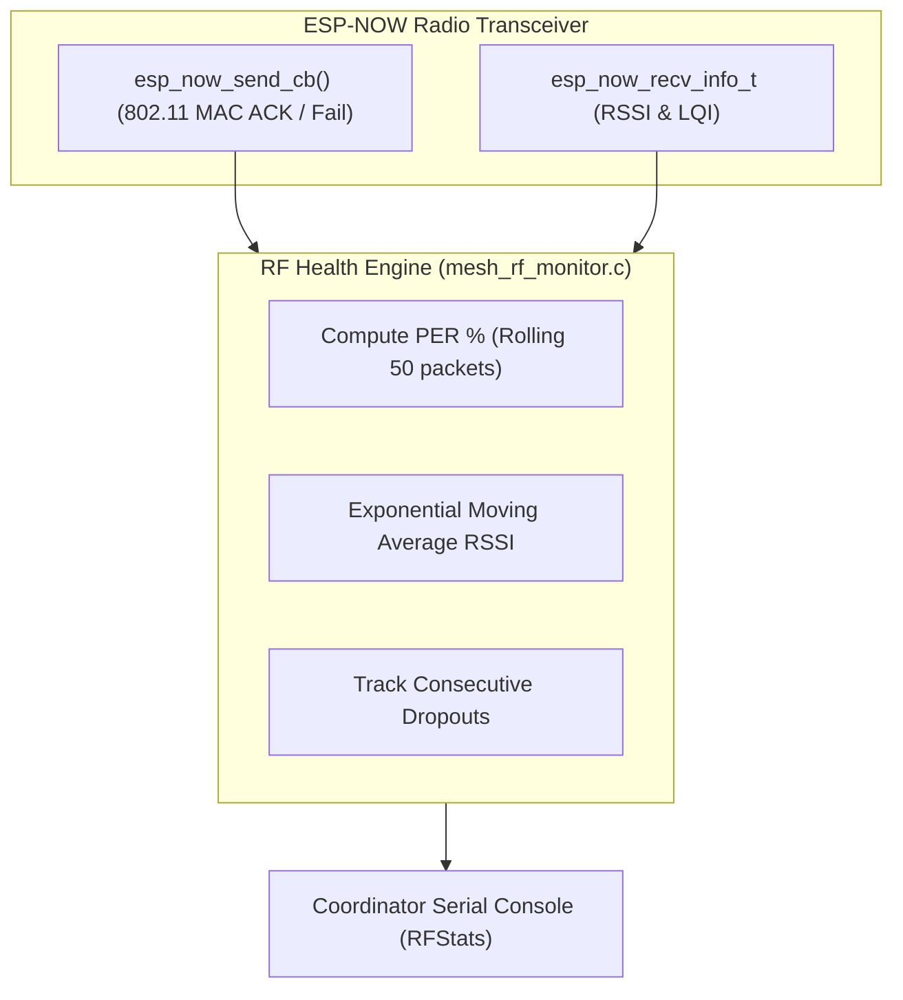
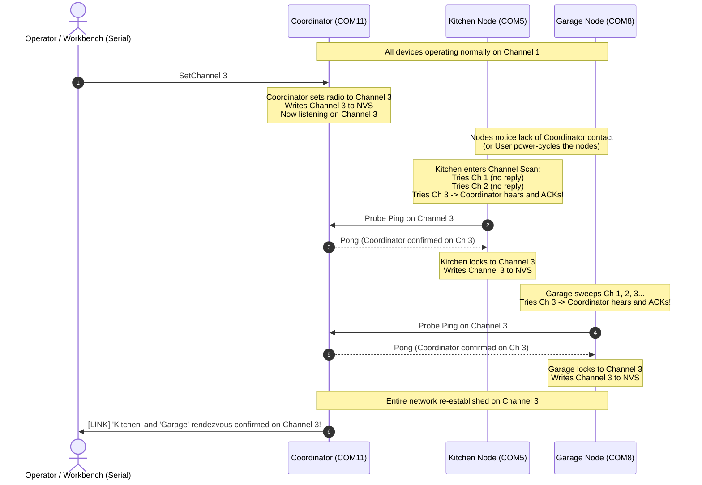

# RF Link Monitoring & Autonomous Scan-and-Lock Channel Migration

**Document:** `RFchannel.md`  
**Target Platform:** Espressif ESP32-C6 (32-bit RISC-V @ 160MHz)  
**Wireless Protocol:** ESP-NOW over 2.4 GHz Long Range (LR) PHY (250 Kbps, +20 dBm)  
**Related Architecture:** [TransitionPlan.md](file:///c:/Users/egape/PNPzigbee/TransitionPlan.md), [PNPzigbee_Architecture_and_Features.md](file:///c:/Users/egape/PNPzigbee/PNPzigbee_Architecture_and_Features.md)  
**Philosophy:** Prioritize simplicity, robustness, and deterministic recovery over complex distributed two-phase commits. Eliminate edge-case bugs by using an **Anchor & Autonomous Scan** model.

---

## 1. Executive Summary & Design Philosophy

In a hobbyist or low-maintenance deployment, complex distributed coordination protocols (such as synchronized countdowns, two-phase commits, and distributed rollback handlers) are prone to subtle edge-case failures:
* What if a node is powered down during the countdown?
* What if RF interference drops the migration packet for only one node?
* What if clock drift causes a node to hop channels before the others?

To eliminate these failure modes, we adopt the **Autonomous Scan-and-Lock Architecture**:
1. **Coordinator as Fixed Anchor:** The Coordinator is the master reference. When you issue `SetChannel <1-11>` on its serial port, the Coordinator tunes its radio to the new channel, saves it to NVS, and immediately begins listening. It does **not** attempt to coordinate or micromanage the nodes.
2. **Nodes Autonomous Seekers:** End Devices (Kitchen, Garage) periodically verify their link to the Coordinator. If contact is lost (or on fresh power-up), the node automatically sweeps through channels 1 to 11. The moment it detects the Coordinator on the new channel, it locks its radio, updates its NVS, and resumes normal operation.
3. **Robust & Bounded:** Scanning is intentionally slowed down with multi-probe retries on each channel to ensure high reliability across walls. The maximum worst-case time to complete reconnection is **deterministic and bounded**.

---

## 2. RF Health & Interference Monitoring Engine

Before deciding to change channels, the operator needs clear visibility into link health and packet loss.

### 2.1 Metrics Model

The ESP32-C6 firmware tracks physical and MAC-layer health on every packet:



### 2.2 Metric Definitions

| Metric | Measurement Method | Interpretation |
| :--- | :--- | :--- |
| **Packet Error Rate (PER %)** | `esp_now_register_send_cb()` | Ratio of failed MAC-layer ACKs to total transmission attempts over a rolling window of 50 packets. High PER indicates RF collisions or jamming from nearby Wi-Fi. |
| **RSSI** (dBm) | `rx_ctrl.rssi` | Signal strength at receiver antenna (-40 dBm = very strong, -85 dBm = fringe). |
| **LQI** | `rx_ctrl` hardware metric | Signal-to-noise quality indicator (0 to 255). |
| **Round Trip Time (RTT)** | Ping/Pong delta in ms | Application latency. Elevated RTT means hardware MAC retries are occurring. |

### 2.3 Health Classification

* **HEALTHY (PER < 5%):** Clean RF channel.
* **DEGRADED (5% ≤ PER < 20%):** Noticeable background activity. Retries succeed, but latency is elevated.
* **HIGH INTERFERENCE (PER ≥ 20%):** Severe interference. Channel change recommended.

### 2.4 Serial CLI: `RFStats` Command

Typing `RFStats` into the Coordinator's serial console displays real-time health across all connected nodes:

```text
coordinator> RFStats
================================ RF LINK HEALTH MONITOR ================================
Current Radio Channel: 1 | PHY: ESP-NOW LR (250 Kbps) | Max TX Power: +20.0 dBm (80)
---------------------------------------------------------------------------------------
Node Name   MAC Address         RSSI (dBm)  LQI    PER (30s)    Total TX    MAC Fails  Status
---------------------------------------------------------------------------------------
Kitchen     B4:3A:45:8A:C6:40   -58 dBm     210     3.2%         1,420       45        HEALTHY
Garage      B4:3A:45:8A:C7:C0   -79 dBm     155    24.1%         1,380      332        HIGH_INTERFERENCE
Santafe     B4:3A:45:8A:C8:10   -82 dBm     118    27.5%           890      245        HIGH_INTERFERENCE
---------------------------------------------------------------------------------------
[DIAGNOSIS] Channel 1 is experiencing heavy co-channel interference for Garage and Santafe.
[ACTION] Recommend moving to Channel 6 or Channel 11 via: 'SetChannel 6'
=======================================================================================
```

---

## 3. Autonomous Scan-and-Lock Migration

### 3.1 Step-by-Step Sequence



---

## 4. Deterministic Timing & Worst-Case Bound Analysis

Because this design favors **rock-solid RF robustness over speed**, we intentionally slow down the scan dwell time and transmit **multiple probe packets** on each channel to punch through temporary fading or walls.

### 4.1 Timing Budget Breakdown

| Phase | Timing Parameter | Value | Notes |
| :--- | :--- | :--- | :--- |
| **1. Link Loss Detection** | Heartbeat interval & timeout | **5.0 s** | If node receives no Coordinator packet or ping response for 5 seconds, it concludes the Coordinator has moved or rebooted. *(Skipped if the user power-cycles the node).* |
| **2. Probing per Channel** | Dwell time per channel | **300 ms** | On each channel, the node transmits **3 separate discovery pings** spaced 100 ms apart, waiting for a reply. |
| **3. Full Spectrum Sweep** | 11 Channels (1 to 11) | **3.3 s** | \( 11 \text{ channels} \times 300\text{ ms} = 3.3\text{ seconds} \). |
| **4. Inter-Sweep Backoff** | Rest period between sweeps | **1.0 s** | Short pause with random jitter (±200 ms) to prevent multiple nodes from colliding if they scan simultaneously. |
| **5. Second Sweep (if needed)** | Full retry sweep | **3.3 s** | In case severe interference masked the first attempt. |

### 4.2 Maximum Worst-Case Bounds

$$\text{Worst-Case Time (Automatic / No Power-Cycle)} = \underbrace{5.0\text{ s}}_{\text{Detection}} + \underbrace{3.3\text{ s}}_{\text{Sweep 1}} + \underbrace{1.0\text{ s}}_{\text{Backoff}} + \underbrace{3.3\text{ s}}_{\text{Sweep 2}} \approx \mathbf{12.6\text{ seconds}}$$

$$\text{Worst-Case Time (With Power-Cycle / Boot)} = \underbrace{0.0\text{ s}}_{\text{Boot}} + \underbrace{3.3\text{ s}}_{\text{Sweep 1}} + \underbrace{1.0\text{ s}}_{\text{Backoff}} + \underbrace{3.3\text{ s}}_{\text{Sweep 2}} \approx \mathbf{7.6\text{ seconds}}$$

> [!IMPORTANT]
> **Deterministic Guarantee:**  
> Even if you switch the Coordinator to a completely different channel and walk away, all remote nodes are guaranteed to locate the Coordinator and lock onto the new channel in **under 15 seconds** (or under 8 seconds if power-cycled).

---

## 5. Edge-Case Immunity Matrix

| Scenario | What Happens? | Why It Can Never Hang or Brick |
| :--- | :--- | :--- |
| **Power loss during channel switch** | Coordinator reboots on new channel; nodes reboot on old channel. | Nodes scan at boot, find Coordinator within 3.5 seconds, and heal automatically. |
| **Node is turned off during migration** | Node is stored in a drawer for 3 months, then powered on. | On boot, node tries old channel, fails, sweeps channels 1..11, locks onto the Coordinator, and saves new channel to NVS. |
| **Flash memory degradation** | Frequent channel changes or scans. | The node **only writes to NVS if the channel actually changed**. Redundant discoveries do not touch flash. |
| **Neighboring Wi-Fi on the same channel** | Node hears foreign Wi-Fi packets. | ESP-NOW filter and firmware check for magic header bytes (`0xAA 0x55`) and Coordinator MAC. Non-matching packets are discarded in microseconds. |
| **Multiple nodes scanning at once** | Kitchen and Garage both lose contact and scan simultaneously. | Random jitter in the inter-probe backoff (100 ms ± 30 ms) prevents packet collisions between scanning nodes. |

---

## 6. Implementation Code Blueprint

### 6.1 Coordinator Implementation (Under 10 Lines)

When the user enters `SetChannel <ch>` on the Coordinator serial port:

```c
// In Coordinator serial command parser:
static esp_err_t coordinator_set_channel(uint8_t new_channel) {
    if (new_channel < 1 || new_channel > 11) {
        printf("[ERROR] Channel must be between 1 and 11\r\n");
        return ESP_ERR_INVALID_ARG;
    }

    // 1. Set the physical Wi-Fi radio channel
    esp_wifi_set_channel(new_channel, WIFI_SECOND_CHAN_NONE);

    // 2. Commit permanently to NVS
    nvs_config_set_channel(new_channel);

    printf("[RADIO] Coordinator radio tuned to Channel %u and committed to NVS.\r\n", new_channel);
    printf("[RADIO] Listening for End Device rendezvous probes...\r\n");
    return ESP_OK;
}
```

### 6.2 Node Scan-and-Lock Task

On the End Devices (Kitchen, Garage), a FreeRTOS background task manages link verification and autonomous hunting:

```c
#include "esp_wifi.h"
#include "esp_now.h"
#include "esp_random.h"
#include "freertos/FreeRTOS.h"
#include "freertos/task.h"

static bool s_coordinator_acknowledged = false;

// Called by ESP-NOW receive callback when Coordinator replies to a probe
void node_on_coordinator_reply(uint8_t received_channel) {
    s_coordinator_acknowledged = true;
}

void node_scan_and_lock_task(void *pvParameters) {
    uint8_t current_nvs_channel = nvs_config_get_channel(); // Default: 1
    
    while (1) {
        // Step 1: Normal Link Check on current channel
        s_coordinator_acknowledged = false;
        node_send_probe_ping();
        vTaskDelay(pdMS_TO_TICKS(1000));

        if (s_coordinator_acknowledged) {
            // Coordinator is present and healthy
            continue;
        }

        // Check if link has been dead for > 5 consecutive seconds
        if (++missed_pings < 5) {
            continue;
        }

        // Step 2: Coordinator lost! Enter Autonomous Channel Scan
        ESP_LOGW("RF_SCAN", "Lost contact with Coordinator. Beginning 1..11 channel sweep...");

        bool found = false;
        for (int pass = 0; pass < 2 && !found; pass++) {
            for (uint8_t ch = 1; ch <= 11; ch++) {
                esp_wifi_set_channel(ch, WIFI_SECOND_CHAN_NONE);
                
                // Transmit 3 probes spaced 100ms apart (300ms total dwell time)
                for (int probe = 0; probe < 3; probe++) {
                    s_coordinator_acknowledged = false;
                    node_send_probe_ping();
                    vTaskDelay(pdMS_TO_TICKS(100));
                    
                    if (s_coordinator_acknowledged) {
                        ESP_LOGI("RF_SCAN", "Found Coordinator on Channel %u!", ch);
                        found = true;
                        
                        // Step 3: Lock channel and commit to NVS only if changed
                        if (ch != current_nvs_channel) {
                            nvs_config_set_channel(ch);
                            current_nvs_channel = ch;
                            ESP_LOGI("RF_SCAN", "Committed Channel %u to NVS.", ch);
                        }
                        missed_pings = 0;
                        break;
                    }
                }
                if (found) break;
            }

            if (!found) {
                // Inter-sweep backoff with random jitter (800 - 1200 ms)
                uint32_t jitter = 800 + (esp_random() % 400);
                vTaskDelay(pdMS_TO_TICKS(jitter));
            }
        }
    }
}
```

---

## 7. Operational Workflow for the User

When you encounter RF interference or want to change channels:

1. **Step 1: Check Current RF Health**
   ```text
   coordinator> RFStats
   ```
   Inspect the PER percentage. If Channel 1 is degraded, decide on a clean channel (e.g., Channel 6).

2. **Step 2: Change Coordinator Channel**
   ```text
   coordinator> SetChannel 6
   ```
   The Coordinator immediately switches to Channel 6.

3. **Step 3: Wait or Power-Cycle (Your Choice)**
   * **Hands-off (Do nothing):** Wait **~10–12 seconds**. The remote nodes will detect link loss, sweep channels 1–11, find the Coordinator on Channel 6, and lock on automatically.
   * **Immediate (Power-cycle):** If you toggle power to the nodes, they will boot up, sweep, and lock onto Channel 6 in **under 4 seconds**.
