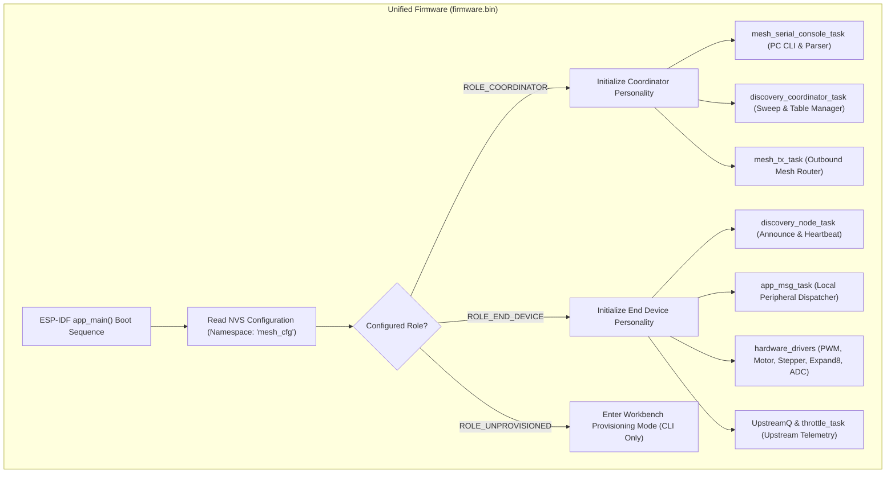
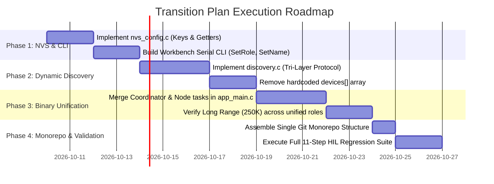

# Architectural Blueprint & Transition Plan: Unified Single-Firmware Mesh Network

**Document:** `TransitionPlan.md`  
**Target Platform:** Espressif ESP32-C6 (32-bit RISC-V @ 160MHz)  
**Wireless Protocol:** ESP-NOW over 2.4 GHz Long Range (LR) PHY (250 Kbps, +20 dBm)  
**Supporting Ecosystem:** PlatformIO Arduino (`TXRXproto`), Python HIL (`ZigbeeTestRunner`), ESP-IDF v6.0  
**Companion Document:** [RFchannel.md](file:///c:/Users/egape/PNPzigbee/RFchannel.md) (RF interference monitoring & dynamic OTA channel migration)  
**Purpose:** Comprehensive implementation guide for transitioning from separate `Coordinator` and `PNPzigbee` codebases to a **Single-Firmware, Role-Provisioned, Self-Healing Monorepo Architecture**.

---

## 1. Executive Vision & Core Objectives

### 1.1 The Problem Statement
Currently, the system maintains two separate ESP-IDF projects:
1. `Coordinator`: Functions as a USB-serial command gateway and maintains a hardcoded array of MAC addresses for each node (`Kitchen`, `Garage`, `Santafe`).
2. `PNPzigbee`: Functions as the peripheral actuator/sensor node, reading its own MAC address at boot to infer whether it is `"Kitchen"` or `"Garage"`, with a hardcoded coordinator MAC.

This dual-binary structure introduces unnecessary friction:
* Any change to core RF or shared transport code must be manually copied between two repositories.
* Adding a new node or swapping a board requires editing C source files, recompiling, and flashing both the node and the coordinator.
* Hardware boards are not interchangeable in the field.

### 1.2 The Target State
* **One Binary (`firmware.bin`):** Every ESP32-C6 device runs identical compiled firmware.
* **Workbench Provisioning:** Node roles (`Coordinator` vs `EndDevice`) and names (`Kitchen`, `Garage`) are configured via interactive serial CLI commands and stored permanently in **NVS (Non-Volatile Storage)**.
* **Zero Hardcoded MACs:** Nodes and the Coordinator learn each other's addresses dynamically over the air using a multi-layer self-healing discovery protocol.
* **Monorepo Structure:** The unified firmware, Arduino test fixture, and Python test suite are housed in a single, cohesive Git repository.

---

## 2. System Architecture & Role Model



### 2.1 Role Definitions
* **`ROLE_COORDINATOR`:**
  * Connects to host PC via USB-Serial/JTAG.
  * Translates PC commands (`<Target> <Command>`) into mesh frames.
  * Maintains an in-memory dynamic routing table mapping node names to MAC addresses.
  * Collects and reports upstream telemetry back to PC console.
* **`ROLE_END_DEVICE`:**
  * Executes physical actuation and sensor monitoring (LEDC PWM, DRV8833, Steppers, PCF8574 Expand8, VL53L1X, APDS9930, ADC).
  * Evaluates threshold comparators and streams events upstream to the learned coordinator.
* **`ROLE_UNPROVISIONED` (Factory Default):**
  * Emits status LED breathing pattern.
  * Keeps radio in low-power listening state and waits for workbench serial configuration.

---

## 3. Persistent Configuration Schema (NVS)

The ESP-IDF NVS library stores configuration keys in the `"mesh_cfg"` namespace:

| Key | Type | Default Value | Description |
| :--- | :--- | :--- | :--- |
| `role` | `uint8_t` | `0` (`UNPROVISIONED`) | `0` = Unprovisioned, `1` = End Device, `2` = Coordinator |
| `name` | `string` | `"Node"` | Human-readable node name (max 16 chars: e.g. `"Kitchen"`, `"Garage"`) |
| `channel` | `uint8_t` | `1` | 2.4 GHz RF Channel (1–14) |
| `coord_mac` | `blob` (6 B) | `FF:FF:FF:FF:FF:FF` | Learned or pre-set coordinator MAC address |
| `tx_power` | `int8_t` | `80` (+20.0 dBm) | Maximum transmitter output power (0.25 dBm units) |
| `lr_mode` | `uint8_t` | `1` (Enabled) | 1 = `WIFI_PROTOCOL_LR` active (250 Kbps), 0 = Standard Wi-Fi |

### 3.1 C Configuration Structure
```c
typedef enum {
    ROLE_UNPROVISIONED = 0,
    ROLE_END_DEVICE    = 1,
    ROLE_COORDINATOR   = 2
} mesh_role_t;

typedef struct {
    mesh_role_t role;
    char        node_name[18];
    uint8_t     channel;
    uint8_t     coordinator_mac[6];
    int8_t      tx_power;
    bool        long_range_enabled;
} mesh_config_t;
```

---

## 4. Workbench Provisioning CLI

When an unprovisioned board (or any existing board) is connected via USB to a developer PC or factory workbench, the serial monitor provides intuitive interactive provisioning commands:

### 4.1 CLI Command Reference
```text
=== Workbench Configuration Commands ===

SetRole Coordinator
    -> Configures node as the central PC gateway. Saves to NVS and reboots.

SetRole EndDevice <NodeName>
    -> Example: SetRole EndDevice Kitchen
    -> Sets role to End Device, stores name as "Kitchen", saves to NVS, and reboots.

SetName <NewName>
    -> Example: SetName Garage
    -> Renames an existing End Device without changing other parameters.

SetChannel <1-11>
    -> Sets the primary RF channel for this node (default: 1).
    -> On Coordinator: changes channel; nodes automatically scan & re-lock (see RFchannel.md).

SetTxPower <power_quarter_dbm>
    -> Sets maximum RF output power (e.g. 80 for +20 dBm).

ShowConfig
    -> Displays current NVS configuration, MAC address, active role, and uptime.

FactoryReset
    -> Erases the 'mesh_cfg' NVS namespace and reverts board to UNPROVISIONED.
```

### 4.2 Interactive CLI Example Session
```text
workbench> ShowConfig
[CONFIG] Role: UNPROVISIONED (0)
[CONFIG] Name: Unassigned
[CONFIG] MAC:  B4:3A:45:8A:C6:40
[CONFIG] RF:   Channel 1, TX Power 80 (+20.0 dBm), Long Range: ON

workbench> SetRole EndDevice Kitchen
[NVS] Writing role: END_DEVICE (1)... OK
[NVS] Writing name: "Kitchen"... OK
[NVS] Configuration committed successfully.
[SYS] Restarting node in 1 second...
```

---

## 5. Tri-Layer Self-Healing Discovery Protocol

To completely eliminate hardcoded MAC addresses and prevent silent/stranded nodes over wireless RF, the network implements a **tri-layer discovery and recovery mechanism**:

```mermaid
sequenceDiagram
    autonumber
    participant ED as End Device (Kitchen)
    participant RF as ESP-NOW RF Medium
    participant COORD as Coordinator (Gateway)

    Note over ED,COORD: Layer 1: Node Boot Announcement with Exponential Backoff
    ED->>RF: Broadcast HELLO (Name="Kitchen", MAC=C6:40)
    RF-->>COORD: Received Broadcast HELLO
    COORD->>COORD: Add/Update Table: "Kitchen" -> C6:40
    COORD->>RF: Unicast HELLO_ACK to C6:40
    RF-->>ED: Received HELLO_ACK
    Note over ED: Announcement Confirmed (Stops Retrying)

    Note over ED,COORD: Layer 2: Coordinator Startup Discovery Sweep
    Note over COORD: Coordinator Power Cycles / Reboots
    COORD->>RF: Broadcast DISCOVER_ALL ("Who is there?")
    RF-->>ED: Received DISCOVER_ALL
    ED->>RF: Unicast HELLO to Coordinator
    COORD->>COORD: Immediate Table Re-population (<100ms)

    Note over ED,COORD: Layer 3: Broadcast Fallback (Zero-Fail Safety Net)
    Note over COORD: User enters "Kitchen on", but Kitchen is not in RAM table
    COORD->>RF: Broadcast Frame (Target="Kitchen", Cmd="on")
    RF-->>ED: Kitchen hears broadcast, matches target name, executes
    ED->>RF: Unicast Response ("ACK", Src="Kitchen", MAC=C6:40)
    COORD->>COORD: Learns Kitchen's MAC from ACK header
    Note over COORD: Caches MAC; all subsequent commands use fast Direct Unicast
```

### 5.1 Layer 1: ACK-Confirmed Node Boot Announcement
* **Behavior:** When an End Device powers on, it broadcasts:
  `HELLO name="<NodeName>" mac=<STA_MAC>`
* **Retry Engine:** If no `HELLO_ACK` arrives within `500 ms`, the node retries with exponential backoff:
  `1s -> 2s -> 5s -> 10s`, followed by a periodic **30-second background heartbeat**.
* **Coordinator Auto-Discovery:** When the Coordinator replies with `HELLO_ACK`, the End Device automatically captures and saves the Coordinator’s MAC address for its upstream telemetry queue (`UpstreamQ`).

### 5.2 Layer 2: Coordinator Startup Discovery Sweep
* **Problem Addressed:** What if 10 End Devices are already deployed and running, and the Coordinator is rebooted? The nodes already booted hours ago and are not broadcasting boot announcements.
* **Mechanism:** Upon booting, the Coordinator immediately broadcasts:
  `DISCOVER_ALL`
* **Response:** Every listening node in range generates an immediate unicast identification reply. The Coordinator populates its entire routing table in under **100 milliseconds**.

### 5.3 Layer 3: Broadcast Fallback (Zero-Fail Safety Net)
* **Problem Addressed:** What if a burst of interference causes an announcement to fail, or an End Device was added while the radio channel was temporarily congested?
* **Mechanism (ARP-Style Resolution):**
  1. User enters `Kitchen on` in the Coordinator console.
  2. The Coordinator checks its in-memory table.
  3. If `"Kitchen"` is unmapped, instead of returning an error, the Coordinator dispatches the frame as an **ESP-NOW Broadcast** (`FF:FF:FF:FF:FF:FF`) with payload header `target="Kitchen"`.
  4. Kitchen receives the broadcast, verifies the target name matches its local NVS name, and executes the command.
  5. Kitchen sends back an ACK containing its MAC address.
  6. The Coordinator extracts the MAC address from the incoming frame, binds `"Kitchen" -> MAC` into its RAM routing table, and uses **fast direct unicast** for all future commands.

---

## 6. Monorepo Repository Structure

The entire system—including firmware, Arduino test fixture, and Python test harness—is organized into a single Git repository:

```text
PNPzigbee-Mesh/                     <-- Root Git Repository
├── .gitignore
├── README.md
├── TransitionPlan.md               <-- This Document
│
├── firmware/                       <-- Unified ESP-IDF Project (C)
│   ├── CMakeLists.txt
│   ├── sdkconfig.defaults
│   ├── partitions.csv
│   └── main/
│       ├── CMakeLists.txt
│       ├── app_main.c              <-- Boot sequence & role branching
│       ├── nvs_config.c / .h       <-- NVS key-value storage & workbench CLI
│       ├── mesh_espnow.c / .h      <-- ESP-NOW LR PHY, RF switch & transmission
│       ├── discovery.c / .h        <-- Tri-layer announcement & table management
│       ├── serial_gateway.c / .h   <-- Coordinator PC CLI & routing logic
│       ├── UpstreamQ.c / .h        <-- End Device rate-limiting upstream queue
│       ├── Expand8.c / .h          <-- PCF8574 8-bit I2C I/O expander
│       ├── GPIO_handler.c / .h     <-- Dynamic digital I/O & edge detection
│       ├── adc.c / .h              <-- 12-bit ADC & hysteresis comparators
│       ├── pwm_driver.c / .h       <-- 4-channel PWM generator & slew limiter
│       ├── motor_driver.c / .h     <-- Brushed DC motor driver (DRV8833/Cytron)
│       ├── BLDC_driver.c / .h      <-- ESC 50Hz RC brushless driver
│       ├── Stepper.c / .h          <-- 4-phase stepper motor controller
│       ├── NeoPixel.c / .h         <-- WS2812 addressable RGB driver
│       ├── VL53L1X.c / .h          <-- Laser ToF distance sensor
│       ├── apds9930.c / .h         <-- Optical proximity & ambient light sensor
│       ├── I2Craw.c / .h           <-- Direct I2C register diagnostics
│       └── serial_bridge.c / .h    <-- Hardware UART bridge to external MCU
│
├── fixture/                        <-- PlatformIO Project (C++)
│   ├── platformio.ini              <-- Board: adafruit_trinket_m0 (SAMD21)
│   └── src/
│       └── main.cpp                <-- TXRXproto HIL test fixture (DotStar, DAC, D0)
│
├── tools/                          <-- Python Test & Automation Suite
│   ├── requirements.txt            <-- pyserial, pytest
│   ├── test_runner.py              <-- 11-step automated HIL regression test runner
│   └── provision.py                <-- Automated workbench batch provisioning script
│
└── docs/                           <-- System Documentation
    ├── Architecture.md
    └── RF_Survey_Guidelines.md
```

### 6.1 Multi-Framework Coexistence
* **ESP-IDF (`firmware/`):** Built using standard ESP-IDF toolchain (`idf.py build`, `idf.py -p <PORT> flash`).
* **PlatformIO (`fixture/`):** Built using PlatformIO CLI (`pio run -d fixture/`, `pio run -d fixture/ -t upload`).
* **Python (`tools/`):** Run natively using Python 3 (`python tools/test_runner.py -p COM11`).

---

## 7. Migration & Execution Phases



### Phase 1: NVS Provisioning & Workbench CLI
1. Create `firmware/main/nvs_config.c` and `nvs_config.h`.
2. Implement non-volatile storage read/write functions for `role`, `node_name`, `channel`, `tx_power`, and `lr_mode`.
3. Add serial console command parser for workbench setup: `SetRole`, `SetName`, `ShowConfig`, `FactoryReset`.

### Phase 2: Dynamic Discovery & Routing Engine
1. Create `firmware/main/discovery.c` and `discovery.h`.
2. Implement Layer 1: Node boot announcement with exponential backoff and background heartbeat.
3. Implement Layer 2: Coordinator startup sweep (`DISCOVER_ALL`).
4. Implement Layer 3: Coordinator broadcast fallback for unmapped nodes.
5. Replace the static `devices[]` array in the Coordinator with a dynamic RAM hash/table with age and LQI tracking.

### Phase 3: Single-Binary Consolidation (`app_main.c`)
1. Integrate Coordinator gateway logic (`serial_gateway.c`) and End Device peripheral logic into a unified `firmware/` component.
2. In `app_main()`, evaluate `nvs_config_get_role()`:
   * If `ROLE_COORDINATOR`: Launch console gateway task, table manager task, and discovery sweep.
   * If `ROLE_END_DEVICE`: Launch peripheral drivers, upstream queue, and discovery announcement.
3. Retain existing LR settings: `WIFI_PROTOCOL_LR`, max TX power (80 = +20 dBm), and per-peer rate `WIFI_PHY_RATE_LORA_250K`.

### Phase 4: Repository Assembly & HIL Verification
1. Create root Git repository `PNPzigbee-Mesh`.
2. Move unified firmware into `firmware/`, `TXRXproto` into `fixture/`, and `test_runner.py` into `tools/`.
3. Flash the single `firmware.bin` to all three workbench nodes:
   * Program `COM11` with `SetRole Coordinator`.
   * Program `COM5` with `SetRole EndDevice Kitchen`.
   * Program `COM8` with `SetRole EndDevice Garage`.
4. Run `python tools/test_runner.py -p COM11 --all` to verify that all 11 HIL regression tests pass identically.

---

## 8. Verification & Acceptance Criteria

When this transition plan is executed in the new chat, the system is verified against the following criteria:

- [ ] **Single Compilation Target:** A single build command (`idf.py build` inside `firmware/`) produces the sole binary used across all network nodes.
- [ ] **Zero Hardcoded MACs:** Source code contains no static MAC addresses for `Kitchen`, `Garage`, or `Coordinator`.
- [ ] **Workbench Provisioning:** Typing `SetRole Coordinator` or `SetRole EndDevice <Name>` on a fresh board successfully stores the role in NVS and activates that personality after reboot.
- [ ] **Power-Cycle Recovery:** Powering off the Coordinator and powering it back on restores full network communication in < 500 ms without requiring node reboots.
- [ ] **Random Boot Order Resilience:** Nodes powering on before, during, or after Coordinator boot are detected and registered automatically.
- [ ] **RF Integrity Preserved:** Long Range mode (250 Kbps PHY) and +20 dBm output power remain active on all devices.
- [ ] **Regression Suite Pass:** Automated test suite passes 100% of end-to-end HIL tests:
  * Two-way Ping & Round-trip (`ping` -> `GotPing`)
  * Hardware DAC & ADC Loopback (`setDAC` -> `ReadADC`)
  * Visual Actuation (`blinkx`, `blink`)
  * Bidirectional GPIO wire test (Kitchen Pin 21 <-> Garage Pin 17)
  * PCF8574 Expand8 read/write (`wrExpand8`, `rdExpand8`)

